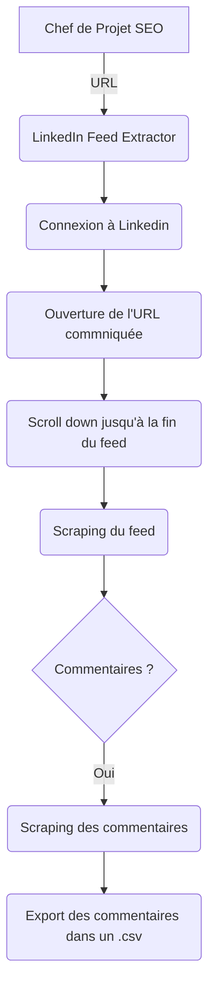

# LinkedIn Feed Extractor

## Ressources
- Python
- Selenium
- BeautifulSoup
- Pandas

## Objectif du projet

## Algorithme

## Checklist  
Fonctions à créer:
- [x] Connection à Linkedin
- [x] Scroller l'ensemble du feed
- [ ] Soup tous les posts
- [ ] Si le post à des commentaires, ouvrir les commentaires
- [ ] Soup le feed commentaire du post
- [ ] S'il faut, afficher plus de commentaires
- [ ] Enregistrer dans un dictionnaire les infos liées au commentaire
  - [ ] Nom de la personne
  - [ ] Verbatim
  - [ ] Date du commentaire
  - [ ] Lien du post
  - [ ] Date de création du post
- [ ] Ajouter ces éléments à un DataFrame
- [ ] Exporter les résultats en .csv

