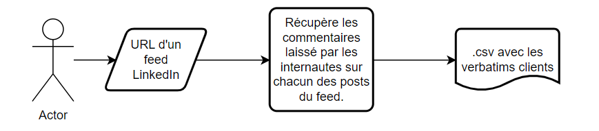
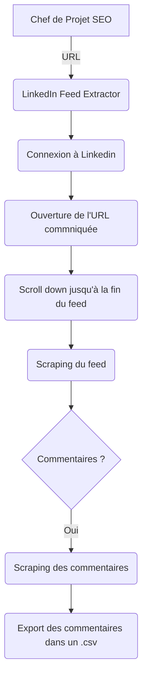

# LinkedIn Feed Extractor

## Ressources
- Python
- Selenium
- BeautifulSoup
- Pandas

## Objectif du projet

## Algorithme

## Checklist  
Scrapper les commentaires - Fonctions à implémenter:
- [x] Connection à Linkedin
- [x] Scroller l'ensemble du feed
- [x] Soup tous les posts
- [x] Si le post à des commentaires, ouvrir les commentaires (double clic sur le bouton)
- [x] Enregistrer dans un dictionnaire les infos liées au commentaire
  - [x] Nom de la personne
  - [x] Verbatim
  - [x] Date du commentaire
  - [x] Description du post
  - [x] Date de création du post
- [x] Ajouter ces éléments à un DataFrame
- [x] Exporter les résultats en .csv

Ajouts possibles :
- [X] Scraper les réponses aux commentaires.
- [ ] Scraper les commentaires sur les posts partagés.

Industrialiasation du programme :
- [x] Création des fonctions (Notebook)
- [x] Industrialisation sous PyCharm.
- [ ] Mettre en place cet outil sur un serveur.

## Utilisation
Run main.py en donnant deux arguments :
- l'url du feed à scraper
- le nom du fichier avec son extension.
